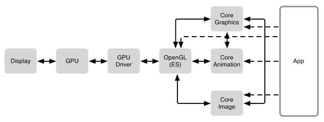
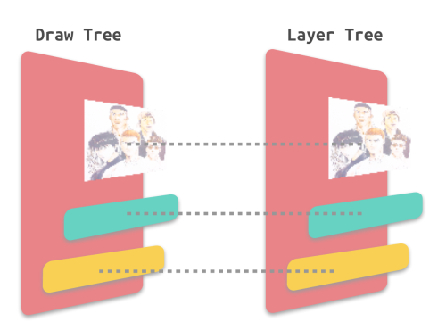
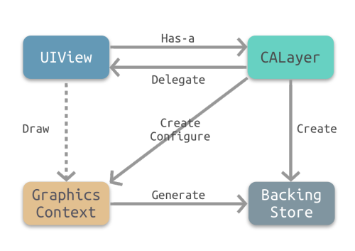
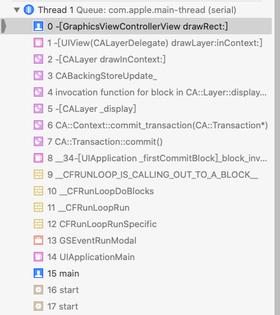
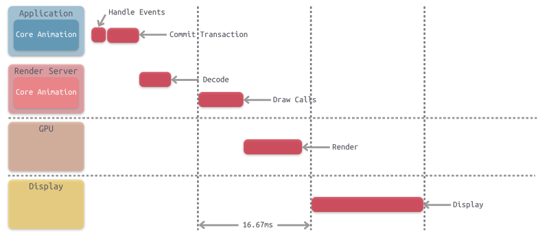
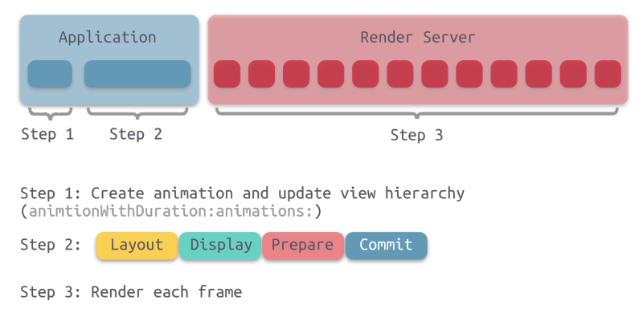
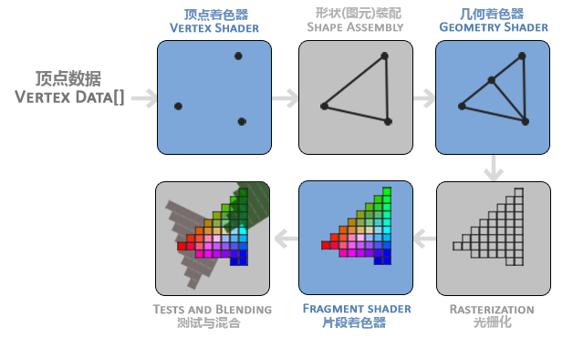

<!-- README.md -->

# iOS图像渲染

2018-09-20

## 1. UIKit

UIKit是iOS开发者最常用和熟悉的UI框架，承担着UI显示和用户交互的功能。UIView在UIKit框架中最基本的单元，[苹果官方文档](https://developer.apple.com/documentation/uikit/uiview?language=objc)描述UIView的基本功能：

* 绘制和动画(Drawing and animation)
* 布局和子视图管理（Layout and subview management)
* 事件处理（Event handling）

UIView本身其实并不支持图层的绘制，显示和管理，这些能力是来自于CALayer。

```c
@interface UIView : UIResponder

@property(nonatomic,readonly,strong) CALayer  *layer;             
// returns view's layer. Will always return a non-nil value. view is layer's delegate

@end
```

CALayer是Core Animation的核心类，提供了展示图像和动画的能力。而CALayer展示的内容可以是图片或者视频，也可以是运行时绘制的图像。图片的处理则依赖于Core Image,运行时绘制图像的能力则依赖于Core Graphic。

## 2. iOS 渲染框架

下图所示为 iOS App 的图形渲染技术栈，App 使用 Core Graphics、Core Animation、Core Image 等框架来绘制可视化内容，这些软件框架相互之间也有着依赖关系。这些框架都需要通过 OpenGL 来调用 GPU 进行绘制，最终将内容显示到屏幕之上。



*  **Core Animation**

	Core Animation 源自于 Layer Kit,基本功能是渲染，组合和动画
	
	Core Animation 是一个复合引擎，其职责是 尽可能快地组合屏幕上不同的可视内容，这些可视内容可被分解成独立的图层（即 CALayer），这些图层会被存储在一个叫做图层树的体系之中。从本质上而言，CALayer 是用户所能在屏幕上看见的一切的基础。

* **Core Graphic**

	Core Graphics 基于 Quartz 高级绘图引擎，主要用于运行时绘制图像。开发者可以使用此框架来处理基于路径的绘图，转换，颜色管理，离屏渲染，图案，渐变和阴影，图像数据管理，图像创建和图像遮罩以及 PDF 文档创建，显示和分析。

* **Core Image**

	Core Image 与 Core Graphics 恰恰相反，Core Graphics 用于在 运行时创建图像，而 Core Image 是用来处理运行前创建的图像 的。Core Image框架拥有一系列现成的图像过滤器，能对已存在的图像进行高效的处理。

* **OpenGL ES**

	OpenGL ES（OpenGL for Embedded Systems，简称 GLES），是 OpenGL 的子集。OpenGL 是一套第三方标准，函数的内部实现由对应的 GPU 厂商开发实现。

* **Metal**

	Metal 类似于 OpenGL ES，也是一套第三方标准，具体实现由苹果实现。大多数开发者都没有直接使用过 Metal，但其实所有开发者都在间接地使用 Metal。Core Animation、Core Image、SceneKit、SpriteKit 等等渲染框架都是构建于 Metal 之上的。
	
## 3. UIView 和 CALayer的关系

CALayer是UIView的backing store，为UIView提供了呈现图像的能力。而UIView继承于UIResponder, 扩展了交互的能力。

UIView通过视图树管理和布局视图，CALayer通过图层树来管理和布局图层，这两者是一致的。当在视图树中添加或者删除视图，在对应图层树中也有一致的操作。



### 3.1 那么为什么 iOS 要基于 UIView 和 CALayer 提供两个平行的层级关系呢？

* 职责分离，这样也能避免很多重复代码
* 在 iOS 和 Mac OS X 两个平台上，事件和用户交互有很多地方的不同，基于多点触控的用户界面和基于鼠标键盘的交互有着本质的区别，这就是为什么 iOS 有 UIKit 和 UIView，对应 Mac OS X 有 AppKit 和 NSView 的原因。它们在功能上很相似，但是在实现上有着显著的区别。

### 3.2 CALayer的寄宿图

CALayer呈现的图像内容，保存在contents属性中，可以存放位图数据，称为寄宿图。

```c
@interface CALayer : NSObject

/** Layer content properties and methods. **/

/* An object providing the contents of the layer, typically a CGImageRef,
 * but may be something else. (For example, NSImage objects are
 * supported on Mac OS X 10.6 and later.) Default value is nil.
 * Animatable. */

@property(nullable, strong) id contents;

@end
```

contents可以直接保存解码后的位图数据，也可以保存运行时绘制的位图数据。

####  1. 直接保存图片数据
 
 ```c
 // contents属性是id类型，在iOS中只能传递CGImageRef类型，所有需要强转
view.layer.contents = (__bridge id) image.CGImage;
 ```

####  2. 保存运行时绘制的图像

实际开发中，一般通过继承 UIView 并实现 -drawRect: 方法来自定义绘制。绘制的结果生成为CABackingStore对象，存在contents属性中。

> UIView 不实现 drawRect 不会生成寄宿图，因此避免性能问题，在不需要自定义绘制视图时，不要重写drawRect.

### 3.3 UIView为CALayer扩展用户交互的能力

在可交互式系统中，应用所呈现的图像需要跟随用户的交互而变化，而UIView正好为CALayer扩展用户交互的能力。

CALayer的UIView的一个属性，UIView是CALayer的delegate,实现了CALayerDelegate协议。

```c
@protocol CALayerDelegate <NSObject>
@optional

/* If defined, called by the default implementation of the -display
 * method, in which case it should implement the entire display
 * process (typically by setting the `contents' property). */

- (void)displayLayer:(CALayer *)layer;

/* If defined, called by the default implementation of -drawInContext: */

- (void)drawLayer:(CALayer *)layer inContext:(CGContextRef)ctx;

/* If defined, called by the default implementation of the -display method.
 * Allows the delegate to configure any layer state affecting contents prior
 * to -drawLayer:InContext: such as `contentsFormat' and `opaque'. It will not
 * be called if the delegate implements -displayLayer. */

- (void)layerWillDraw:(CALayer *)layer
  CA_AVAILABLE_STARTING (10.12, 10.0, 10.0, 3.0);

/* Called by the default -layoutSublayers implementation before the layout
 * manager is checked. Note that if the delegate method is invoked, the
 * layout manager will be ignored. */

- (void)layoutSublayersOfLayer:(CALayer *)layer;

/* If defined, called by the default implementation of the
 * -actionForKey: method. Should return an object implementating the
 * CAAction protocol. May return 'nil' if the delegate doesn't specify
 * a behavior for the current event. Returning the null object (i.e.
 * '[NSNull null]') explicitly forces no further search. (I.e. the
 * +defaultActionForKey: method will not be called.) */

- (nullable id<CAAction>)actionForLayer:(CALayer *)layer forKey:(NSString *)event;

@end
```



* 随着交互，UIView调用-setNeedsDisplay,希望CALayer更新内容

``` c
/* Marks that -display needs to be called before the layer is next
 * committed. If a region is specified, only that region of the layer
 * is invalidated. */

- (void)setNeedsDisplay;
- (void)setNeedsDisplayInRect:(CGRect)r;
```

* CALayer在数据提交之前会调用-display方法

```c
/* Reload the content of this layer. Calls the -drawInContext: method
 * then updates the `contents' property of the layer. Typically this is
 * not called directly. */

- (void)display;
```

* CALayer的-display方法，首先会尝试调用delegate就是UIView的 -displayLayer: 方法，此时代理可以直接设置 contents 属性。

```c
- (void)displayLayer:(CALayer *)layer;
```

* 如果代理没有实现 -displayLayer: 方法，CALayer 则会尝试调用 -drawLayer:inContext: 方法。在调用该方法前，CALayer 会创建一个空的寄宿图（尺寸由 bounds 和 contentScale 决定）和一个 Core Graphics 的绘制上下文，为绘制寄宿图做准备，作为 ctx 参数传入。-drawLayer:inContext:最终会调用到-drawRect:



* 最后，由 Core Graphics 绘制生成的寄宿图会存入 backing store。

## 4. Core Animation 流水线

CALayer的图像数据最终会提交到GPU去渲染，下面介绍一下 Core Animation 流水线的工作原理。



事实上，App 本身并不负责渲染，渲染则是由一个独立的进程负责，即 Render Server 进程。

App 通过 IPC 将渲染任务及相关数据提交给 Render Server。Render Server 处理完数据后，再传递至 GPU。最后由 GPU 调用 iOS 的图像设备进行显示。

Core Animation 流水线的详细过程如下：

* 首先，App 响应并处理事件，更新图层树，修改view的frame，color等操作

* 接着，App 通过 CPU 完成对显示内容的计算，如：视图的创建、布局计算、图片解码、文本绘制等。在完成对显示内容的计算之后，app 对图层进行打包，并在下一次 RunLoop 时将其发送至 Render Server，即完成了一次 Commit Transaction 操作。

* Render Server 主要执行 Open GL、Core Graphics 相关程序，并调用 GPU

* GPU 则在物理层上完成了对图像的渲染。

* GPU 通过 Frame Buffer、视频控制器等相关部件，将图像显示在屏幕上

### 4.1 Commit Transaction


CoreAnimation中监听 Runloop 的BeforeWaiting的RunloopObserver，通过RunloopObserver来进一步调用Core Animation内部的CA::Transaction::commit()。因此，Commit Transaction操作是在 Runloop 即将进入空闲状态时执行的。

Core Animation会遍历图层树，对需要重新布局，重新绘制的视图重新布局和绘制以及对需要解码的图片等解码。

Commit Transaction 可以细分为4个步骤,Layout,Display,Prepare,Commit：

* Layout

	这个阶段会对需要重新布局view(调用过-setNeedsLayout的view)重新布局，调用view的-layoutSubviews

* Display

	这个阶段主要对view(调用过-setNeedsDisplay的view)重新绘制，会调用到view的-drawRect:

* Prepare

	这个阶段属于附加步骤，一般处理图像的解码和转换等操作。

* Commit

	这个阶段主要将图层进行打包，并将它们发送至 Render Server。该过程会递归执行，因为图层和视图都是以树形结构存在。

### 4.2 Render Server

Render Server 是不同于 App 的另一个专门处理图形渲染和调用 GPU 的进程。App 在 Commit Transaction 阶段将图层树打包通过 IPC 传递给 Render Server . 一旦打包的图层和动画到达 Render Server ，他们会被反序列化来形成另一个叫做 渲染树 的图层树

> App 和 Render Server 之间通过 IPC通信，如果图层树过于复杂，IPC将非常耗时。

Render Server主要有两个工作：

* 针对动画，为每一帧所有的图层属性计算中间值 (这个步骤由CPU处理)

* 调用 GPU 渲染每一帧数据，对于动画，还会渲染每一个中间帧



### 4.3 GPU 渲染工作

CPU将计算好的图元数据和纹理数据交由GPU处理，而GPU会这些数据渲染为可用于显示器显示的一帧帧的像素数据，渲染后的数据保存在帧缓冲区中。



## 参考

[iOS 图像渲染原理](http://chuquan.me/2018/09/25/ios-graphics-render-principle/)

[屏幕卡顿 及 iOS中的渲染流程解析](https://www.jianshu.com/p/c9cca4ceaa00)
