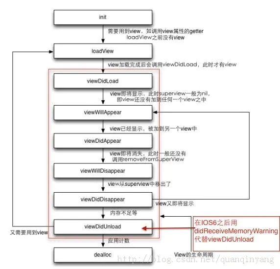
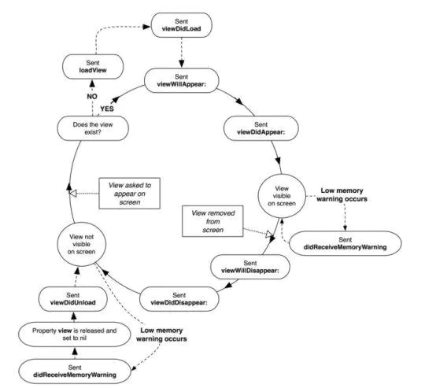
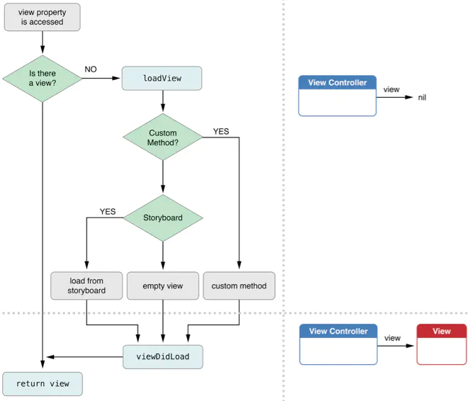
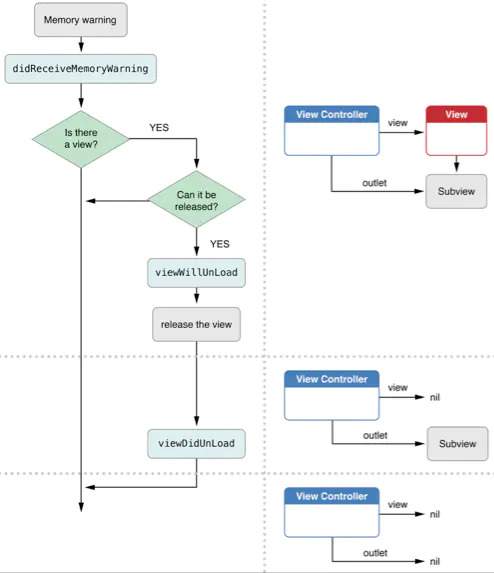

<!-- README.md -->

# iOS UIViewController生命周期

2018-12-29

## 生命周期的图如下：

## ios 视图的生命周期（View Life Cycle）

事件发生的须序非常重要，这好让程序员能在适当的时机执行事件，此时了解view life Cycle是非常必要的。

## View的加载过程

首先访问view属性，如果view存在，则直接加载。如果不存在，则调用loadView方法。

loadView方法执行操作如下：

如果你覆盖了loadView方法，则必须创建view给UIVIewController的view属性，如果你没有覆盖方法，UIViewController会默认调用父类的方法加载初始化view

从图中可以看到，在view加载过程中首先会调用loadView方法，在这个方法中主要完成一些关键view的初始化工作。然后就是加载View,加载成功后接着调用viewDidLoad方法。有一个很重要的地方就是，在loadView之前，view是不存在的，也就是说view还没有被初始化，直到完成viewDidLoad方法后，ViewController里面就成功的加载view了。

## View的卸载

当系统发出内存警告时，会调用didReceiveMemoeryWarning方法，如果当前有能被释放的view，系统会调用viewWillUnload方法来释放view，完成后调用viewDidUnload方法，至此，view就被卸载了。此时原本指向view的变量要被置为nil，具体操作是在viewDidUnload方法中调用.

## 总结：

loadView和viewDidLoad的区别就是，loadView时view还没有生成，viewDidLoad时，view已经生成了，loadView只会被调用一次，而viewDidLoad可能会被调用多次（View可能会被多次加载），当view被添加到其他view中之前，会调用viewWillAppear，之后会调用viewDidAppear。当view从其他view中移除之前，调用viewWillDisAppear，移除之后会调用viewDidDisappear。当view不再使用时，受到内存警告时，ViewController会将view释放并将其指向为nil。

ViewController的生命周期中各方法扫行须序如下：

1. init—>
2. loadView—>
3. viewDidLoad—>
4. viewWillAppear—>
5. viewDidAppear—>
6. viewWillDisappear—>
7. viewDidDisappear—>
8. viewWillUnload->
9. viewDidUnload—>
10. dealloc
