<!-- README.md -->

# iOS JenKins + fastlane 实现自动打包及持续集成

2019-02-13

## 简介

> 持续集成是一种软件开发实践：许多团队频繁地集成他们的工作，每位成员通常进行日常集成，进而每天会有多种集成。每个集成会由自动的构建（包括测试）来尽可能快地检测错误。
许多团队发现这种方法可以显著的减少集成问题并且可以使团队开发更加快捷。

## Jenkins

- Jenkins是一款由Java编写的开源的持续集成工具。
- 提供了一种易于使用的持续集成系统，使开发者从繁杂的集成中解脱出来，专注于更为重要的业务逻辑实现上。同时 Jenkins 能实施监控集成中存在的错误，提供详细的日志文件和提醒功能，还能用图表的形式形象地展示项目构建的趋势和稳定性。

### Jenkins安装

- Jenkins本身是基于java语言开发的，所以安装Jenkins之前，要保证你的电脑有java的jdk，请自行去这里下载对系统安装即可。
- 关于Jenkins的安装有两种方式，一种是直接下载安装包安装，一种是使用包管理工具安装。
- 
#### 安装包
- 通过安装包安装，首先需要去这里下载指定的安装包，如jenkins-2.138.1.pkg，双击安装即可，根据提示下一步。
- 注意的地方在安装类型这一步，选择自定义，然后取消 start at boot as“jenkins”选项，之后一直根据提示就可以安装成功。

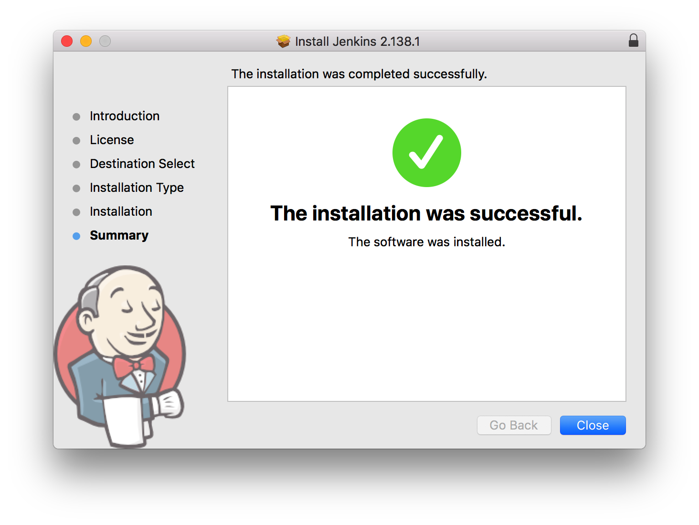


- 安装完成后应该会自动打开一个jenkins的密码页面，如果没有自动打开，请在终端输入如下指令：

```
open /Applications/Jenkins/jenkins.war
```

- 根据提示需要将/Users/Shared/Jenkins/Home/secrets/目录下initialAdminPassword文件中的密码输入到输入框中，但是我们会发现secrets目录是没有权限访问的，此时就需要在secrets文件夹右键显示简介，然后把所有人的权限设置为可读，如果initialAdminPassword还是无法访问，依然需要将它权限设置为可读，直接打开获取密码或者使用如下指令：

```
sudo cat /Users/Shared/Jenkins/Home/secrets/initialAdminPassword
```

- 输入密码登录

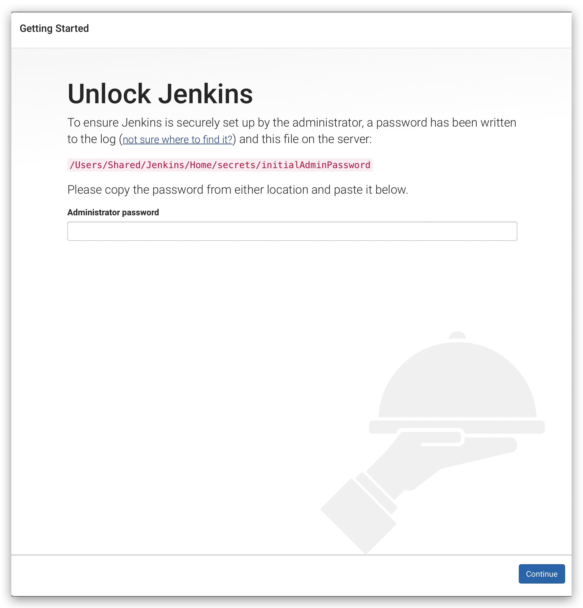

- 输入密码之后就可以根据提示，先安装推荐的一些插件：

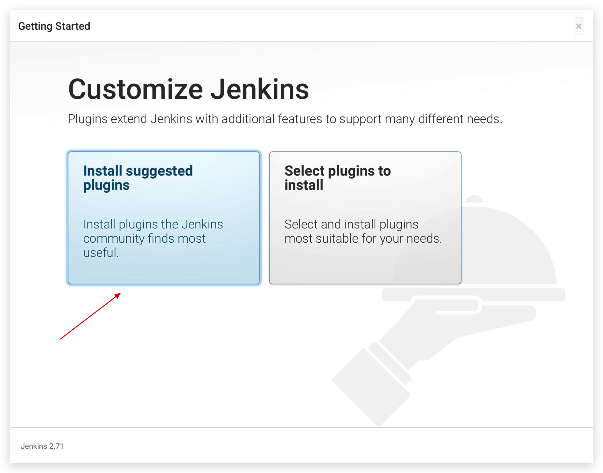

- 完成之后就可以根据提示，创建一个管理员账号：


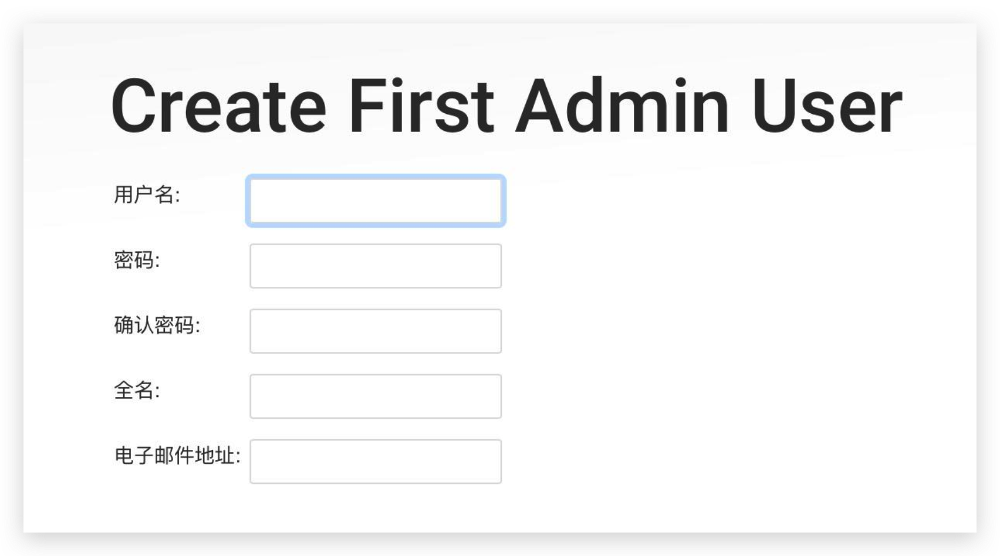


#### homebrew（推荐）

- 使用homebrew安装是比较推荐的一种安装方式，因为直接使用安装包默认会安装在/Users/Shared/Jenkins/目录下，后续使用可能会出现各种权限问题，所以推荐使用homebrew的安装方式，不仅简单，而且是安装在用户目录下，后续比较省事少折腾。
- 在终端输入如下指令，等待安装完成即可：

```
brew install jenkins
```

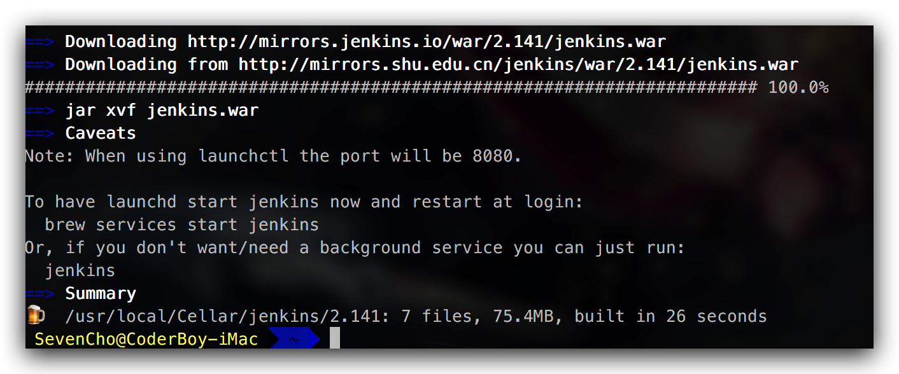

- 安装完成，直接在终端输入下面指令启动Jenkins：

```
jenkins
```

- 启动完成后就可以通过http://localhost:8080/ 访问Jenkins管理界面。
- 默认端口为8080，如果出现端口冲突需要修改端口（如：8888）

```
defaults write /Library/Preferences/org.jenkins-ci httpPort 8888
```

- 之后就和安装包安装一样，需要安装一些默认推荐的插件。


### Jenkins卸载

- 使用 Jenkins 的pkg安装包默认安装位置为/Users/Shared/Jenkins/目录，后续会遇到莫名其妙的权限问题，主要原因还是对原理不是很熟悉。
- 所以如果已经使用pkg安装包安装过需要卸载：进入 /Library/Application Support/Jenkins/ 目录下双击执行Uninstall.command文件卸载即可。


### 常用插件

- 插件安装目录在系统管理->管理插件的可选插件中。
- 首先需要安装源码管理的git插件，因为我们公司是使用GitLab管理代码，所有需要先安装GitLab Plugin和Gitlab Hook Plugin这两个插件。
- 需要使用Xcode编译环境，安装Xcode integration插件。
为了管理打包证书，需要安装Keychains and Provisioning Profiles Management插件。

### 任务

- 准备就绪之后就可以构建一个项目了，一个项目就是一个任务，所以我们先新建一个任务。

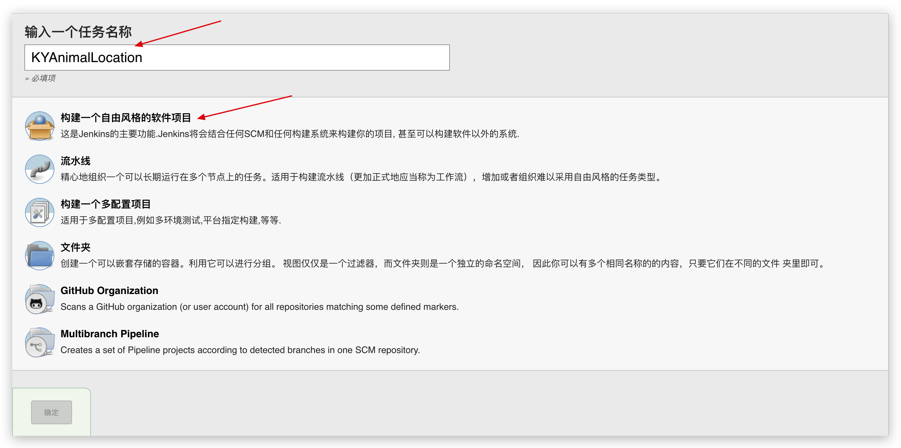

- 新建完一个任务后，就可以进入任务配置界面。


### General

- 项目描述信息，根据项目选填。
- 主要配置一下构建保留的天数和数量信息。


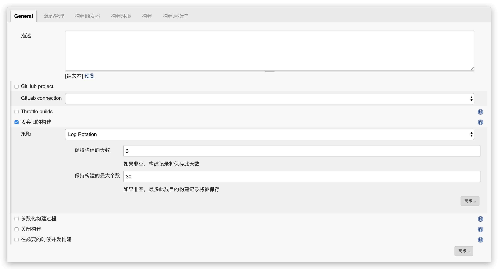

### 源码管理

- 由于现在我们用到的是GitLab，先配置SSH Key，在Jenkins的证书管理中添加SSH用于获取拉取项目的权限。
- 在Jenkins管理页面，选择“Credentials”，然后选择“Global credentials (unrestricted)”，点击“Add Credentials”，如下图所示，我们填写自己的SSH信息，然后点击“Save”，这样就把SSH添加到Jenkins的全局域中去了。


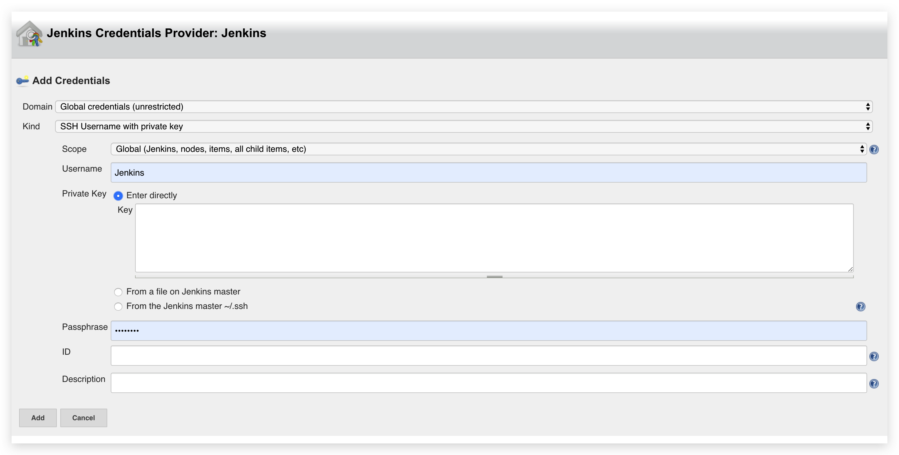

- 然后在git源码管理界面输入项目的仓库地址，并选择上一步配置的证书；选择每次打包的源码的分支，默认是指定主分支。


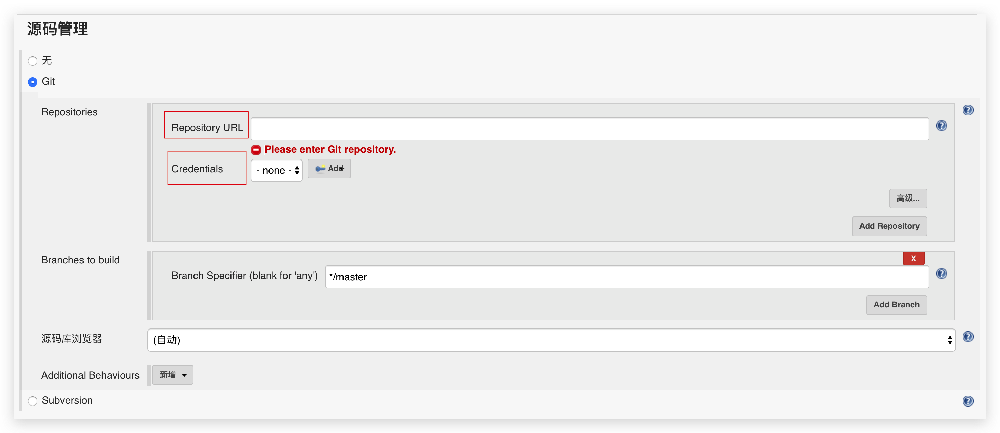

```
ssh://git@192.168.0.28:30001/KYDW_301/iOS_KYDW_301.git
```

### 构建触发器

- 主要用于自动测试流程相关的，用到后再详细研究相关功能及设置，常用触发方式有以下几种。
	- 远程触发，使用地址+token的方式触发。
	- Poll SCM (poll source code management) 轮询源码管理，需要设置源码的路径才能起到轮询的效果。一般设置为类似结果： 0/5 * * * * 每5分钟轮询一次。
	- 设置定时触发，如设置为类似： 00 20 * * * 每天 20点执行定时build 。。

	
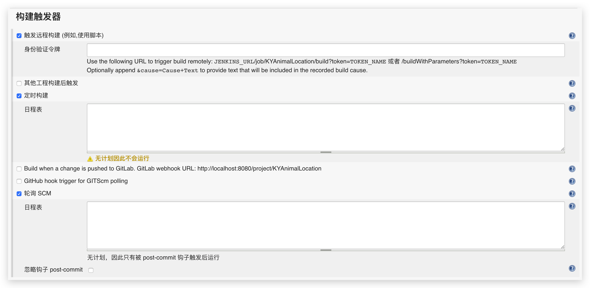

### 构建环境

- iOS打包需要签名文件和证书，所以勾选Keychains and Code Signing Identities和Mobile Provisioning Profiles。


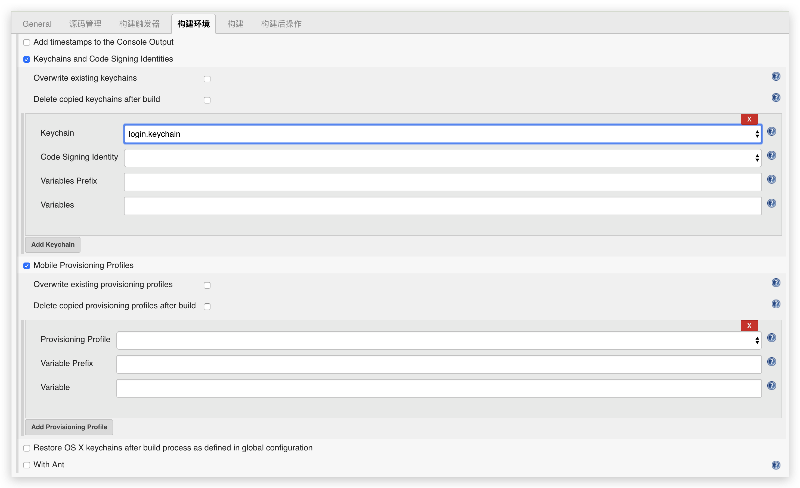

- 这里我们需要用到Jenkins的插件，进入系统管理页面，选择Keychains and Provisioning Profiles Management。
- 进入Keychains and Provisioning Profiles Management页面，点击浏览按钮，分别上传自己的keychain和证书。上传成功后，我们再为keychain指明签名文件的名称，最后添加Add Code Signing Identity。

	- 这里需要的Keychain，并不是cer证书文件。
	- 这个Keychain其实在/Users/管理员用户名/Library/keychains/login.keychain，当把这个Keychain设置好了之后，Jenkins会把这个Keychain拷贝到/Users/Shared/Jenkins/Library/keychains这里，(Library是隐藏文件)。
	- Provisioning Profiles文件也直接拷贝到/Users/Shared/Jenkins/Library/MobileDevice文件目录下。
证书和签名文件在Jenkins中配置好后，接下来回到项目构建环境界面选择对应的证书和签名文件。

### 构建

- 根据自己的需要，选择不同的构建步骤。
- 已经默认有很多可用的脚本，可根据需要选择，也可以自定义添加一系列的构建步骤，一个一个的执行。

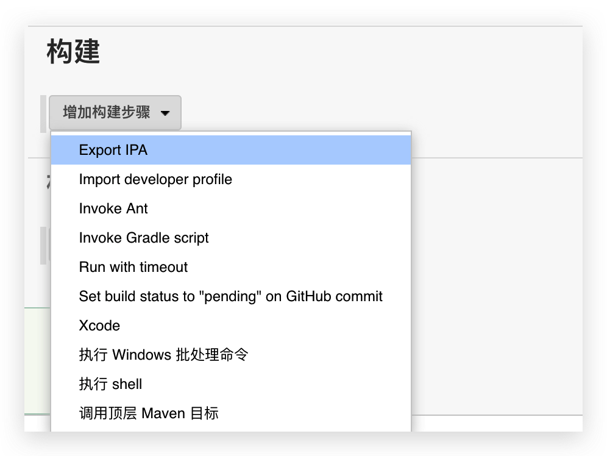

### 构建后操作

- 构建完成后执行的操作，如上传到App Store Connect、内部测试使用、发邮件通知等等。
- 可根据需要添加多个构建步骤。


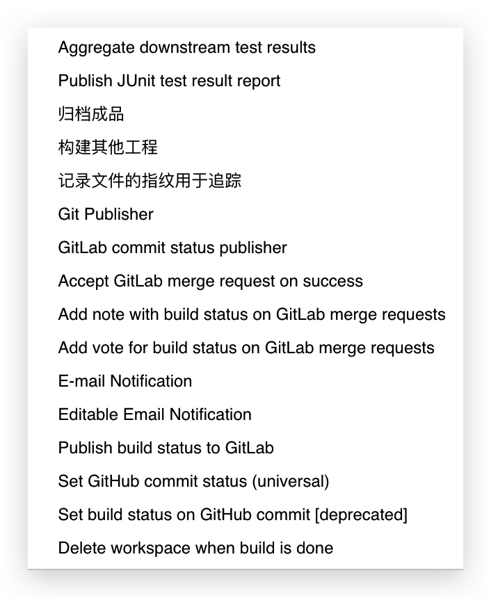

## fastlane

- 对于小团队，不像大公司那样对产品的测试和发布有专门的测试人员，按照严格的程序执行，所以使用fastlane搭建一个轻量级的一键导出安装包及自动化发布的平台会是一个不错的选择。
- 我们传统使用XCode打包Product ——>Archive ——>Upload to AppStore / Export，需要手动一步步选择、等待、最后导出安装包（想想就麻烦）；使用自动打包命令只需在终端输入相应的指令，然后就可以喝着咖啡等待导出ipa安装包成功，或者自动发布到测试平台（蒲公英或者fir.im）和App Store即可，省工、省时、省力，省心。


### 关于自动打包&发布

- 自动打包可用的选项：
	- 将xcodebuild命令封装成一套shell执行脚本，需要打包时候执行即可。
	- 使用Python封装一套自动打包指令。
	- 使用fastlane搭建自动打包发布平台。
	
### 关于fastlane

- fastlane是用Ruby实现的一套自动化命令工具集。可以自动导出ipa包，自动发布测试平台或App Store，甚至简单配置后可以自动截取上架的预览图及自动提交审核。
- 同时fastlane是适用于Android和iOS两个平台的。

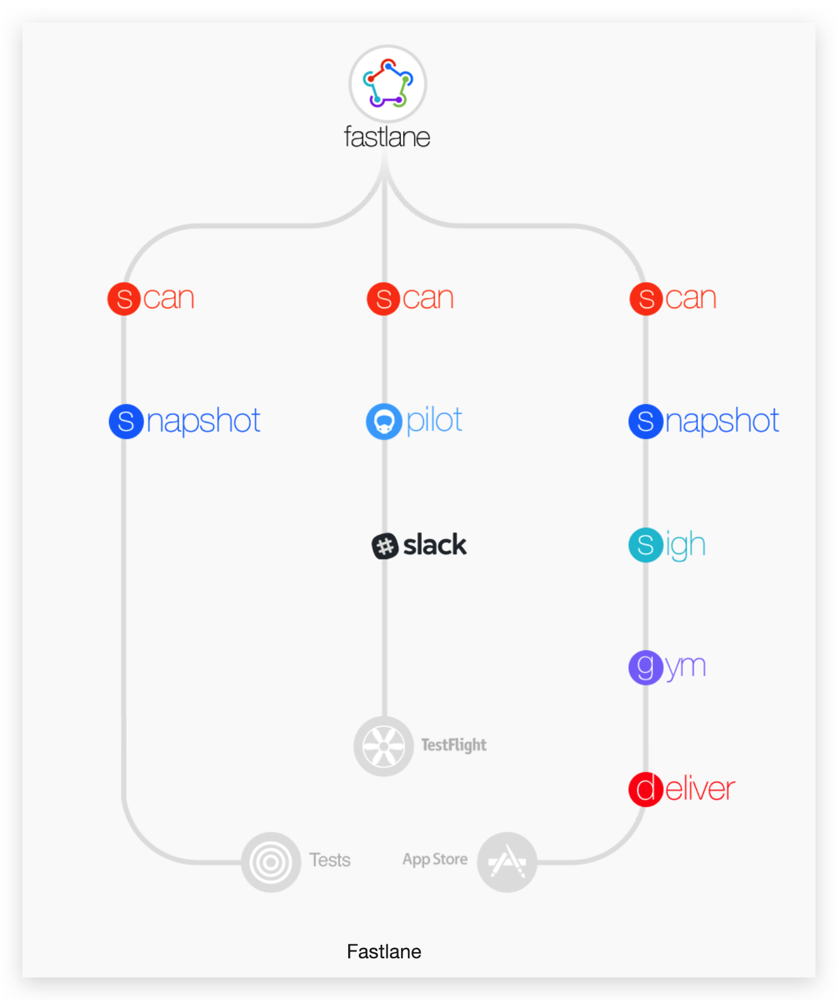

### 安装

- 因为fastlane是基于Ruby实现，首先需要安装Ruby，Mac系统是自带Ruby的，可以在终端输入如下命令查看Ruby版本：

```
ruby -v
```

- 检查 Xcode 命令行工具是否安装，在终端输入如下命令：
	- 如果未安装命令行工具，终端会自动开始安装。
	- 如果提示command line tools are already installed, use "Software Update" to install updates.说明已经安装过。

```
xcode-select --install
```

- 安装fastlane，在终端输入如下命令：

```
sudo gem install fastlane -NV
```

- 如果使用homebrew的用户，推荐使用这种方式安装：

```
brew cask install fastlane
```

### fastlane 配置

- 安装好fastlane后，就可以针对不同的项目配置fastlane。

- 首先，终端cd进入需要配置自动化流程的项目的根目录，在终端输入如下命令：

```
fastlane init
```

- 执行初始化命令后，默认提供了一共4种的常用的自动化配置，选择任何一种都可以，我们都可以再进行自定义：
	1、自动截取屏幕作为预览图（需要配合 UITest ）；
	2、发布发布 TestFlight 测试包；
	3、发布到 App Store；
	4、自定义自动化脚本配置；

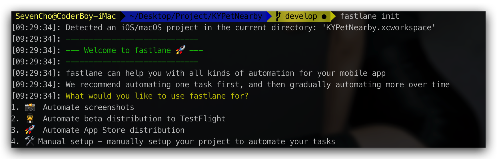

- 如，我们默认选择发布到 App Store 的选项，

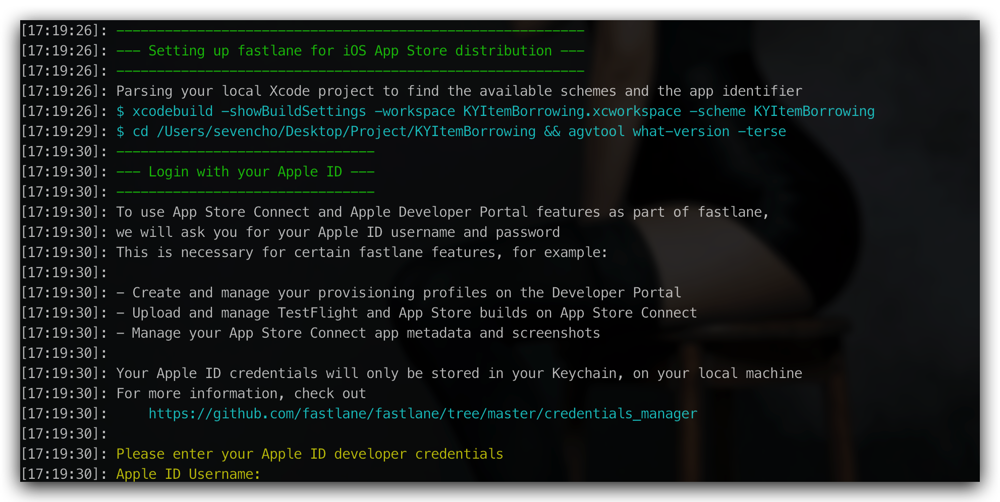

	- 此步骤会提示输入 Apple ID 账号和密码，如果开启了双重验证还需要输入验证码。
	- 如果项目还未在 苹果开发者网站配置过，会提示是否需要在苹果开发者网站创建对应的应用，可以输入n不要自动创建项目。
	- 提示是否建立和 App store 连接，也直接输入n。

- 然后等待配置完成即可。

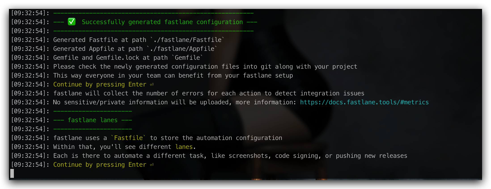

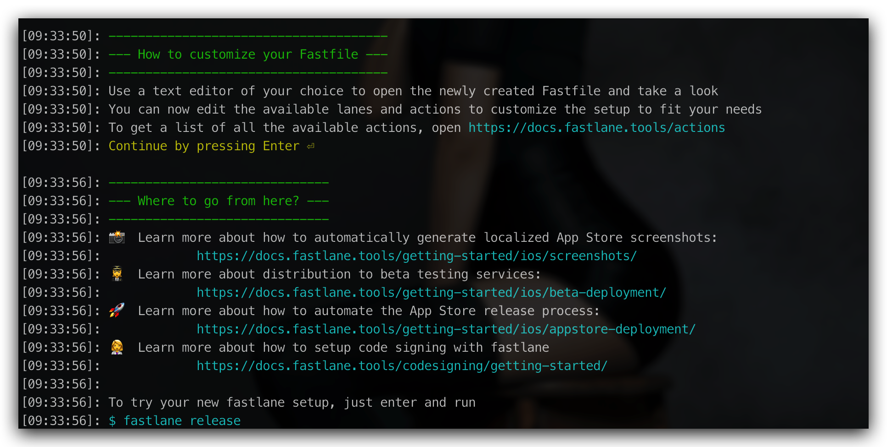

- 安装完成后，项目的根目录会多一个名为fastlane的目录，该文件下有两个文件：

	- Appfile：用来配置项目相关的应用信息，如app_identifier，apple_id和team_id的信息。
	- Fastfile：用来管理和创建的所有自定义的自动化lane步骤，lane可以理解为 fastlane 的执行脚本，一个Fastfile 里可以编写任意个lane，每个lane都可以独立运行，也可以嵌套运行。

- 例如，我们定义一个自动打内测包的lane，这样就不需要每次打测试包的时候选环境，选签名证书，然后Xcode一步步导出了：

- 具体每个字段的意思请参考注释和官方文档。

```ruby
# 在所有操作之前需要做的事情 例如安装项目依赖库 同`pod install`
before_all do
    # cocoapods
  end

  displayName = "KYPetNearby" # 导出的包名
  archiveTime = Time.new.strftime("%Y%m%d%H%M%S") # 包名_20181229161646

  desc "Archive and export an Ad-Hoc ipa package"
  lane :adhoc do # 打adhoc包 （此lane动作名称 用于触发对应流程）

  # build_app 和 gym 都是 build_ios_app的别名
  build_app(
    workspace: "KYPetNearby.xcworkspace",
    scheme: "KYPetNearby", # 工程下要打包的项目,如果一个工程有多个项目则用[项目1,项目2]
    clean: true, # 在构建前先clean
    silent: true, # 终端不显示不需要的信息 默认是false
    include_bitcode: false, # 是否包含bitcode
    configuration: "Release", # 打包配置
    export_method: "ad-hoc", # 指定打包所使用的输出方式，app-store, ad-hoc, package, enterprise, development, developer-id，即xcodebuild的method参数
    output_directory: './Archive', # 打包后的 ipa 文件存放的目录 (项目根目录)
    # output_directory:"/Users/⁨sevencho⁩/Desktop/Archive" # 打包后的 ipa 文件存放的目录 (桌面)
    output_name: "#{displayName}_adhoc_#{archiveTime}",  # ipa 文件名
    export_options: {
      method: "ad-hoc",
      # 指定打包的项目对应的描述文件 格式如下
      provisioningProfiles: { 
        "com.xxxx.KYPetNearby" => "Seven_adHoc_distribution",
      }
    }
    )
  # pgyer(api_key: "api key", user_key: "user key", update_description: "正在将安装包上传到蒲公英") #上传到蒲公英
  # firim(firim_api_token: [firim_api_token]) #上传到firim
	puts("-------------------------------------------------")
	puts("------------ 构建并导出Ad-Hoc ipa成功 -------------")
	puts("-------------------------------------------------")
  end
  
  # 所有动作完成之后的流程
  after_all do |lane|
    # This block is called, only if the executed lane was successful
    # slack(
    #   message: "Successfully deployed new App Update."
    # )
  end
  # 出现错误触发的流程
  error do |lane, exception|
    slack(
      message: exception.message,
      success: false
    )
  end
  ```
  
### 多 Target 配置

- 注意点，需要在xcode开发工具中scheme管理界面将scheme的shared勾选上。
- 上面的只是基本的针对项目单 Target 的配置，但是如果有多个 Target 那么就需要额外的配置，具体如下:


### 配置.env 文件

	工程里面有几个traget，需要创建几个.env。
	该文件中主要就是自定义临时变量，供 Appfile, Deliverfile和 Fastfile使用。
	其他配置文件可通过 ENV['自定义字段名称'] 来读取变量值。
	fastlane 调用时，通过添加参数 --env来指定待读取的 .env 文件，或者再包装一层自定义的lane来调用对应环境的lane脚本。
	如 我们有2个target，分别是KYAnimalLocation 和KYAnimalLocationInternational，那么需要创建两个 .env文件，可以在终端进入项目根目录，使用如下指令创建：

```
touch .env.KYAnimalLocation
touch .env.KYAnimalLocationInternational
```

- .env文件的配置参考如下

```ruby
# APP唯一标识符
APP_IDENTIFIER = "你项目的标识"

# 苹果开发者账号
APPLE_ID = "你的苹果开发者账号"

# 苹果开发者帐号密码
# FASTLANE_PASSWORD = "xxxxxx"

# App Store Connect Team ID
ITC_TEAM_ID = "xxxxxx"

# Developer Portal Team ID
TEAM_ID = "xxxxxx"

# 自动提交审核
SUBMIT_FOR_REVIEW = false

# 审核通过后立刻发布
AUTOMATIC_RELEASE = false

# WORKSPACE名称
WORKSPACE_NAME = "xxx.xcworkspace"
# SCHEME名称
SCHEME_NAME = "当前的target名称 xxx"
# 截图SCHEME名称
SNAPSHOT_SCHEME_NAME = "xxxUITests"

# 发布签名证书描述文件名称
PROVISIONINGPROFILES_DISTRIBUTION_NAME = "发布证书描述文件名称"
# 开发签名证书描述文件名称
PROVISIONINGPROFILES_DEVELOPMENT_NAME = "开发证书描述文件名称"
# 内测签名证书描述文件名称
PROVISIONINGPROFILES_ADHOC_NAME = "adhoc证书描述文件名称"

# APP元数据及截图存放路径
METADATA_PATH = "./fastlane/KYAnimalLocation/metadata"
SCREENSHOTS_PATH = "./fastlane/KYAnimalLocation/screenshots"

# APP元数据及截图下载时，直接覆盖原有数据，不询问
DELIVER_FORCE_OVERWRITE = true

# 发布版本号
# APP_VERSION_RELEASE = "2.1.0"

# 新版本修改记录
# RELEASE_NOTES = "1) 升级测试第一行\n2) 升级测试第二行"

# 蒲公英 更新描述
# PGY_UPDATE_DESCRIPTION = "fastlane自动打包上传测试"
```

### Appfile

- 此时的配置就比较简单了，直接根据变量名称获取对应的参数即可。

```ruby
# The bundle identifier of your app
app_identifier ENV['APP_IDENTIFIER']

# Your Apple email address
apple_id ENV['APPLE_ID'] 

# App Store Connect Team ID
itc_team_id ENV['ITC_TEAM_ID'] 

# Developer Portal Team ID
team_id ENV['TEAM_ID']
```

### 配置 Deliverfile文件

- 在fastlane目录下创建一个Deliverfile文件
- 用于配置自动打包发布 App 到 iTunes Connect 时候的配置

```ruby
# The Deliverfile allows you to store various App Store Connect metadata
# For more information, check out the docs
# https://docs.fastlane.tools/actions/deliver/

# The bundle identifier of your app
app_identifier ENV['APP_IDENTIFIER']

# your Apple ID user
username ENV['APPLE_ID']

# 元数据的路径
metadata_path ENV['METADATA_PATH']
screenshots_path ENV['SCREENSHOTS_PATH']

# 下载 metadata 及 screenshots 时直接覆盖，不询问
force true

# 不覆盖 iTunes Connect原有截图
skip_screenshots ENV['SKIP_SCREENSHOTS']
# 自动提交审核
submit_for_review ENV['SUBMIT_FOR_REVIEW']
# 审核通过后立刻发布
automatic_release ENV['AUTOMATIC_RELEASE']

# App store 中待发布的 App 版本，若每个 target 的版本号不同，可以通过.env 文件来分别定义
# app_version ENV['APP_RELEASE_VERSION']

# 新版本修改记录
# release_notes({
#   "en-US" => "1) upgrade test line 1\n2) upgreade test line 2",
#    "zh-Hans" => "1) 升级测试第一行\n2) 升级测试第二行"
#})

# App 加密算法使用情况及广告相关配置
submission_information({
    # Export Compliance
    export_compliance_available_on_french_store: "false",
    export_compliance_contains_proprietary_cryptography: "false",
    export_compliance_contains_third_party_cryptography: "false",
    export_compliance_is_exempt: "false",
    export_compliance_uses_encryption: "false",
    export_compliance_app_type: nil,
    export_compliance_encryption_updated: "false",
    export_compliance_compliance_required: "false",
    export_compliance_platform: "ios",

    content_rights_contains_third_party_content: "false", # 是否包含，显示，访问第三方内容
    content_rights_has_rights: "false",

    # Advertising Identifier 广告标识符
    add_id_info_limits_tracking: "false",
    add_id_info_serves_ads: "false",
    add_id_info_tracks_action: "false",
    add_id_info_tracks_install: "false",
    add_id_info_uses_idfa: "false"
});
```

- 此时，我们之前针对单项目写死的一些参数，就可以从.env 中加载了

```ruby
desc "Archive and export an Ad-Hoc ipa package"
  lane :adhoc do # 打adhoc包的动作名称

  # build_app 和 gym 都是 build_ios_app的别名
  build_app(
    workspace: "KYAnimalLocation.xcworkspace",
    scheme: ENV['SCHEME_NAME'], # 工程下要打包的项目,如果一个工程有多个项目则用[项目1,项目2]
    clean: true, # 在构建前先clean
    silent: true, # 终端不显示不需要的信息 默认是false
    include_bitcode: false, # 是否包含bitcode
    configuration: "Release", # 打包配置
    export_method: "ad-hoc", # 指定打包所使用的输出方式，app-store, ad-hoc, package, enterprise, development, developer-id，即xcodebuild的method参数
    output_directory: './Archive', # 打包后的 ipa 文件存放的目录 (项目根目录) 桌面："/Users/⁨sevencho⁩/Desktop/Archive"
    output_name: "#{ENV['SCHEME_NAME']}_adhoc_#{archiveTime}",  # ipa 文件名
    export_options: {
      method: "ad-hoc",
      provisioningProfiles: { 
        ENV['APP_IDENTIFIER'] => ENV['PROVISIONINGPROFILES_ADHOC_NAME'],
      }
    }
    )
  # pgyer(api_key: "api key", user_key: "user key", update_description: "正在将安装包上传到蒲公英") #上传到蒲公英
  # firim(firim_api_token: [firim_api_token]) #上传到firim
	puts("-------------------------------------------------")
	puts("------------ 构建并导出Ad-Hoc ipa成功 -------------")
	puts("-------------------------------------------------")
  end
  ```
  
### 自动化构建

- 配置好相关的自动化动作工作流，我们就可以在终端输入指令执行了，例如根据我们配置的自动打测试包lane开始自动打包，只需要终端进入项目根目录，输入 fastlane adhoc 等待完成即可。
 


## 双重验证问题

- 如果我们的账号开启了双重验证，那么需要配置专属密码，否则每次打包都需要中断输入验证码，影响体验。

	首先在苹果账号管理界面生成一个专属的用于自动化构建的密码APP-SPECIFIC PASSWORDS。网址在这里。
	将生成的专属密码通过环境变量FASTLANE_APPLE_APPLICATION_SPECIFIC_PASSWORD提供给fastlan。
	执行fastlane spaceauth -u user@email.com，生成session cookie。
	通过环境变量FASTLANE_SESSION 提供session cookie给fastlan。
	
- 具体就是在~/.bash_profile 中配置如下两个环境变量（如果你使用的是Iterm2 怎在~/.zshrc中配置）：

```
// 注意需要将上面生成的专属密码和session cookie替换下面的=右边的内容
export FASTLANE_APPLE_APPLICATION_SPECIFIC_PASSWORD=专属密码 
export FASTLANE_SESSION=session cookie
```

- 可以使用vim ~/.bash_profile访问bash_profile文件进行添加或者直接进入bash_profile文件目录打开后编辑，注意显示隐藏文件。
- 此方法有效期只有一个月，超过一个月就需要重新配置session cookie，所以一劳永逸的方法就是将打包上架用的开发者账号的双重验证关闭。


### 自动截取屏幕预览图

- 有时候，我们可能会在界面改版后就需要再次截取对应的截面图作为App Store的预览图，如果每次都手动操作就会很繁琐，此时就可以配合UI测试进行自动化截屏。
- 配置好自动截图lane后就可以按照指定的机型及特定界面启动不同模拟器进行截图，截图完成后会生成html预览网页。

- 具体的配置步骤如下：

	创建项目对应的UI Test target，如果已经默认创建过就跳过。
	终端进入项目根目录，执行fastlane snapshot init指令。
	会在fastlane目录下生成Snapfile和SnapshotHelper.swift两个文件。
	
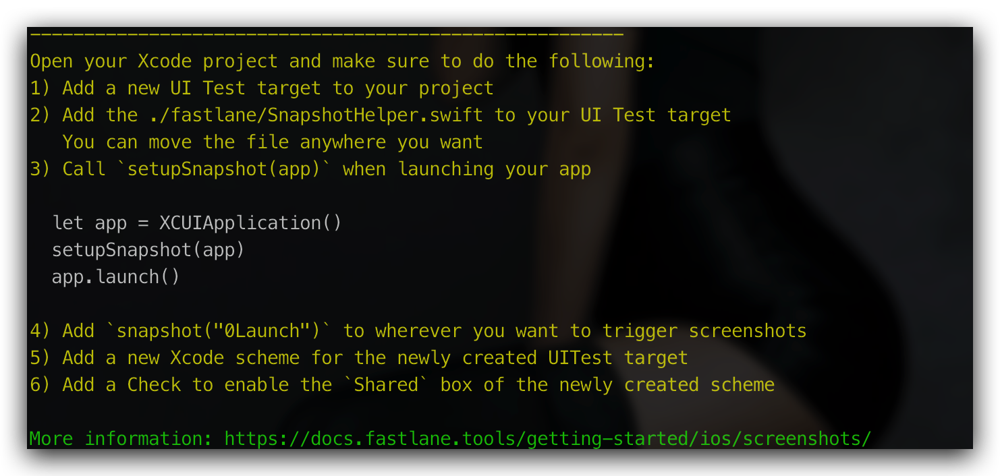

- 把SnapshotHelper.swift文件加入到项目的 UI Test target，注意导入时候选择的target。

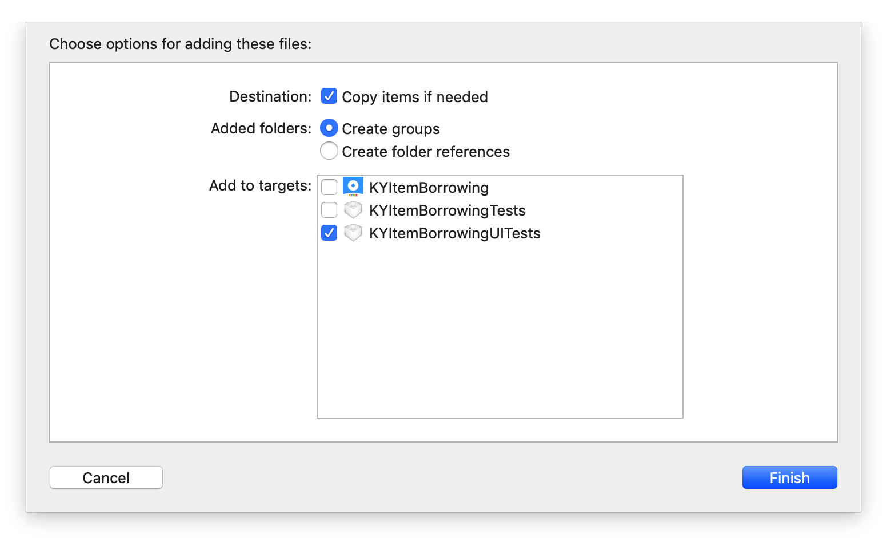

- 如果你的项目是OC，则默认会创建桥接文件：


- 为UI Test target创建一个对应的Xcode scheme

- 选择新建的scheme点击编辑选项，进入编辑界面选择”Build“，然后在”Run“的选项下的方框内勾选；并勾选对应的Shared选项。
如果是OC项目，需要在UI测试类导入桥接文件，桥接文件格式：

```
#import "xxxUITests-Swift.h"

```
xxx是你的项目名称

- 在UI Test类的setUp方法中计入如下代码

如果是Swift项目

```
let app = XCUIApplication()
setupSnapshot(app)
app.launch()
```
如果是OC项目

```c
XCUIApplication *app = [[XCUIApplication alloc] init];
[Snapshot setupSnapshot:app];
[app launch];
```

- 设置Build Settings -> Defines Module设置为YES

- 进入UI测试类，点击左下角的录制按钮（红色圆形），可以将所有的交互动作录制来下自动生成对应的代码。例如哪些界面需要截图，我们就需要点进去对应的界面生成对应的测试代码。

- 如果你发现录制按钮是灰色不可点击状体，请将鼠标在testExample方法内部点击下即可。
- 上一步生成的测试代码中有跳转不同界面的逻辑，我们需要截图就只需跳转界面代码中间插入如下代码：

Swift: 

```
snapshot("01LoginScreen")
```

Objective C:

```
 [Snapshot snapshot:@"01LoginScreen" timeWaitingForIdle:10];
 ```
 
- 截图演示代码如下，参考格式即可，注意录制时如有中文，默认现实的Unicode字符串，请自行查询。

```c
- (void)testExample
{
    [Snapshot snapshot:@"01LoginScreen" timeWaitingForIdle:10];
    
    XCUIApplication *app = [[XCUIApplication alloc] init];
    
    // 登录
    XCUIElement *phoneNumberTextFields = app.textFields[@"\u8bf7\u8f93\u5165\u624b\u673a\u53f7"]; // 请输入手机号
    [phoneNumberTextFields tap];
    [phoneNumberTextFields typeText:@"xxxxxxxxxxxx"];
    
    XCUIElement *passwordTextFields = app.secureTextFields[@"\u8bf7\u8f93\u5165\u5bc6\u7801"]; // 请输入密码
    [passwordTextFields tap];
    [passwordTextFields typeText:@"xxxxxxxxxxxx"];
    
    [app.buttons[@"\u767b\u5f55"] tap]; // 登录
    
    // 截取分类图片
    XCUIElementQuery *tabBarsQuery = app.tabBars;
    [tabBarsQuery.buttons[@"\u5206\u7c7b"] tap]; // 分类
    [Snapshot snapshot:@"02CategoryScreen" timeWaitingForIdle:10];
    // 截取个人界面图片
    [tabBarsQuery.buttons[@"\u6211\u7684"] tap]; // 我的
    [Snapshot snapshot:@"03ProfileScreen" timeWaitingForIdle:10];
    // 截取首页图片
    [tabBarsQuery.buttons[@"\u9996\u9875"] tap]; // 首页
    [Snapshot snapshot:@"04HomeScreen" timeWaitingForIdle:10];
    
    // 截取商品详情图片[[app.collectionViews.otherElements.collectionViews.cells.otherElements childrenMatchingType:XCUIElementTypeImage].element tap]; // 进入商品详情
    [Snapshot snapshot:@"05ItemDetailsScreen" timeWaitingForIdle:10];
    [app.navigationBars[@"\u5546\u54c1\u8be6\u60c5"].buttons[@"btn navbar back"] tap]; // 退出商品详情
}
```

- 编辑Snapfile文件，以指定截取哪些机型及哪些页面的图片，具体配置请参考注释。

```ruby
# 指定截取哪些设备的图片
devices([
"iPhone 8",
"iPhone 8 Plus",
"iPhone SE",
"iPhone X",
"iPhone XS Max",
"iPad Pro (12.9-inch)",
"Apple TV 1080p"
])
# 指定截取的语言类型
languages([
  "en-US",
  "zh-Hans"
])

# The name of the scheme which contains the UI Tests
# scheme("SchemeName")
scheme("你的项目名称UITests")

# 截图保存目录
output_directory("./Screenshots")

# 自动覆盖上次截图？
clear_previous_screenshots(true)

# Arguments to pass to the app on launch. See https://docs.fastlane.tools/actions/snapshot/#launch-arguments
# launch_arguments(["-favColor red"])

# 不要并发运行模拟器截图 默认 true
# concurrent_simulators(false) 

# 某个设备截图出现错误就停止截图 默认 false
stop_after_first_error(true)
output_simulator_logs(true)

# 所有截图完成 打开预览网页 默认 false
# skip_open_summary(true)
```

- 在终端执行fastlane snapshot指令，开始自动启动模拟器截图，等待完成即可。完成后终端会有提示且会打开预览网页（如果配置的默认开启）。

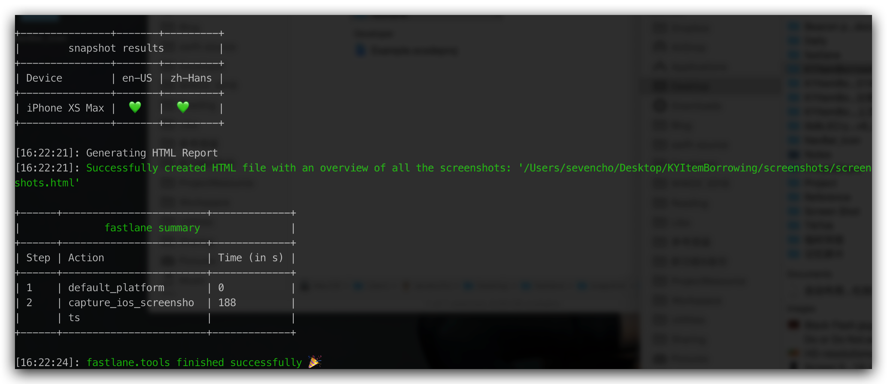

### 下载App Store Connect上元数据和屏幕截图

- 我们可以使用自动化脚本打发布用的安装包，然后手动上传到App Store Connect配置发布应用；也可以直接在本地配置应用在App Store Connect的发布需要的相关配置，然后一键上传发布即可。
- 要本地配置就需要将App Store Connect应用的已有配置信息拉取到本地：

	拉取App相关的元数据及配置参数到本地（发布配置选项以文本文件方式分类）
	
```
bundle exec fastlane deliver download_metadata -a yourBundleIdentifier -m ./fastlane/metadata/KYAnimalLocation -u yourAppleID
```

	拉取App配置的启动图

```
bundle exec fastlane deliver download_screenshots -a yourBundleIdentifier -m ./fastlane/screenshots/KYAnimalLocation -u yourAppleID
```

- 以后发布新上线版本，就可以在本地修改相关信息如新版本更新信心、替换预览图等等；然后一个指令上传并发布新版本审核。


### 参考
[手把手教你利用Jenkins持续集成iOS项目](https://www.jianshu.com/p/41ecb06ae95f)

[jenkins+xcode+蒲公英实现ipa自动化打包](http://www.cocoachina.com/ios/20170811/20218.html)

[iOS持续集成（一）——fastlane 使用](https://juejin.im/post/5b7e6b97f265da43445f630d)

[fastlane官方文档](https://docs.fastlane.tools/)


