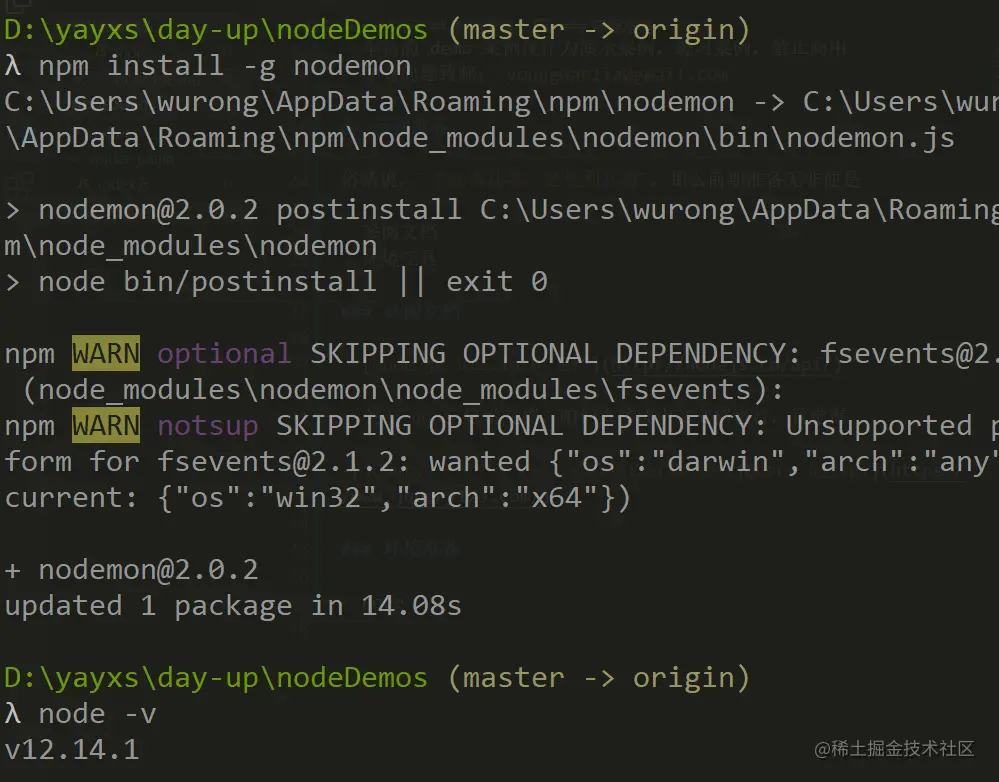
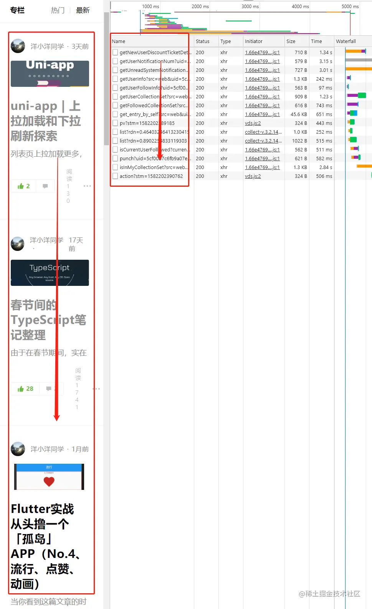
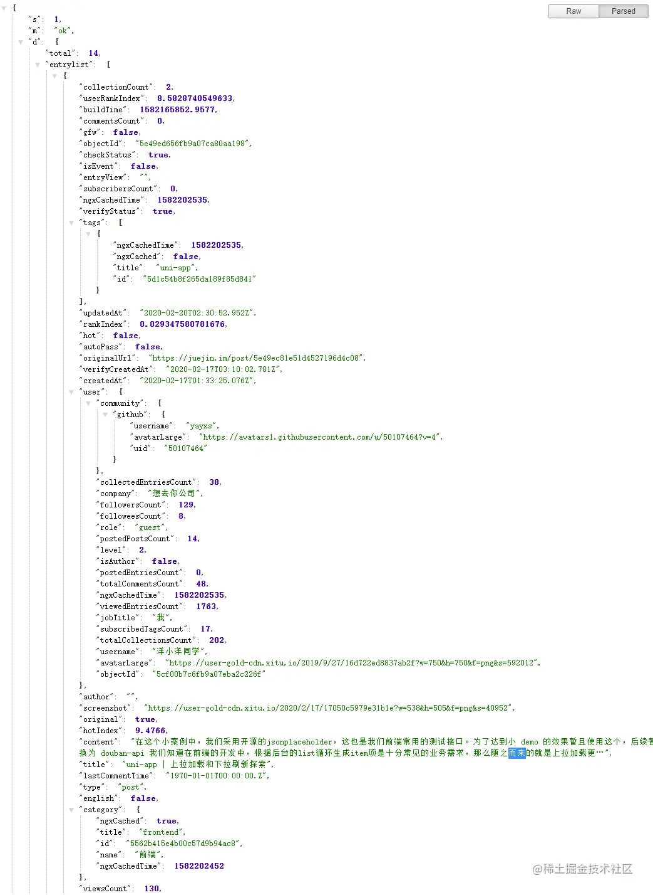
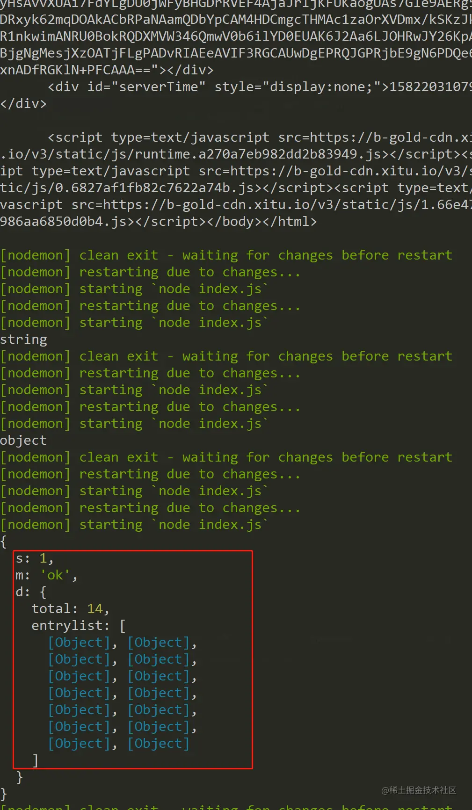
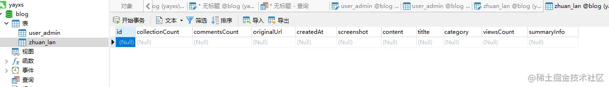
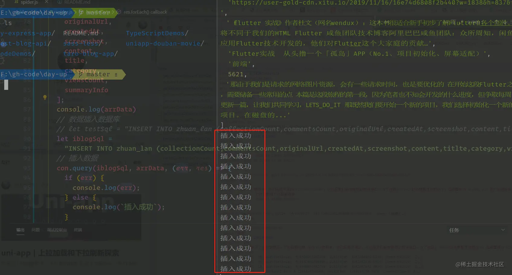
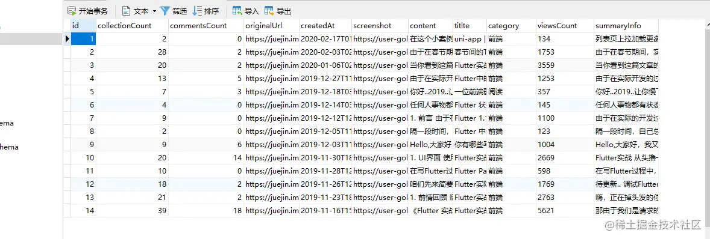

<!-- README.md -->

# Node 爬虫初体验

2020-06-10

利用node爬取简单页面数据并利用本地mysql存储

## 前期准备

俗话说，工欲善其事，必先利其器，那么前期准备无非便是

* 参阅文档
环境工具

## 必阅文档


* [Node.js v12.16.0 文档](http://nodejs.cn/api/)
关于node这份文档，咱们直接读中文文档也行，我觉得


* [jQuery 一个中文文档](https://www.jquery123.com/)，在线可以查看一些 jQuery 的 api


至于爬个虫为什么还需要jQuery 呢，请接着阅读

## 环境准备

安装必要库

node && nodemon

```
npm install -g nodemon
```



* axios

```
yarn add  axios
```


* mysql

```
yarn add mysql
```

* cheerio

```
yarn add cheerio
```


## 需求分析

获取专栏的列表，刷新列表页分析接口的请求



爬取相关的数据，然后存入数据库表里

经过我们对接口的分析，得出:获得数据专栏的api便是这个
```
https://timeline-merger-ms.juejin.im/v1/get_entry_by_self?src=web&uid=5cf00b7c6fb9a07eba2c226f&device_id=1580692913721&token=eyJhY2Nlc3NfdG9rZW4iOiJqa3FzYTJaUzB3cTY3VVBoIiwicmVmcmVzaF90b2tlbiI6ImJrcG9LMnAyaUlSUFRvSFUiLCJ0b2tlbl90eXBlIjoibWFjIiwiZXhwaXJlX2luIjoyNTkyMDAwfQ%3D%3D&targetUid=5cf00b7c6fb9a07eba2c226f&type=post&limit=20&order=createdAt
```

发现可以直接浏览器地址栏查询，目前来看的话只有14条，因为我才刚刚写14条



那我们就在 node 环境下跑一下这个接口

```js
async function getEntryBySelf() {
  let reqUrl = `https://timeline-merger-ms.juejin.im/v1/get_entry_by_self?src=web&uid=5cf00b7c6fb9a07eba2c226f&device_id=1580692913721&token=eyJhY2Nlc3NfdG9rZW4iOiJqa3FzYTJaUzB3cTY3VVBoIiwicmVmcmVzaF90b2tlbiI6ImJrcG9LMnAyaUlSUFRvSFUiLCJ0b2tlbl90eXBlIjoibWFjIiwiZXhwaXJlX2luIjoyNTkyMDAwfQ%3D%3D&targetUid=5cf00b7c6fb9a07eba2c226f&type=post&limit=20&order=createdAt`;
  const res = await axios.get(reqUrl);
  const {
    s,
    m,
    d: { total, entrylist }
  } = res.data;
  if (s === 1 && m === "ok") {
    // 请求成功
    return entrylist;
  } else {
    return `reqErr`;
  }
}
```


## MySql 结合 Node

我们通过使用node环境然后操作数据库，在这篇文章就简单的说一下数据相关的操作，后续会持续更新，希望能够关注笔者github

### 数据库连接

```js
// 配置对象
const config = {
  host: "localhost", // 主机地址
  user: "root", // 数据库用户
  password: "123456", // 密码
  database: "blog" // 数据库
};
// 建立连接
let con = mysql.createConnection(config);
con.connect(err => {
  if (err) {
    console.log(`数据库建立失败`);
  }
});
```

### 建表-专栏

在blog 数据库新建zhuan_lan表用来存放掘金专栏的文章，并初始化一些字段，这里与爬取的数据字段名大致一致



### 插入数据库

```js
// 数据插入数据库
// let testSql = "INSERT INTO zhuan_lan (collectionCount,commentsCount,originalUrl,createdAt,screenshot,content,titlte,category,viewsCount,summaryInfo) VALUES (21,2121,'212','212','212','212','212','221','2121','212')";
let iblogSql =
  "INSERT INTO zhuan_lan (collectionCount,commentsCount,originalUrl,createdAt,screenshot,content,titlte,category,viewsCount,summaryInfo) VALUES (?,?,?,?,?,?,?,?,?,?)";
// 插入数据
con.query(iblogSql, arrData, (err, res) => {
  if (err) {
    console.log(err);
  } else {
    console.log(`插入成功`);
  }
});
```



### 插入数据库



