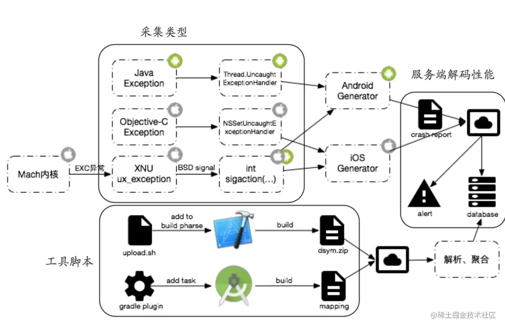

<!-- README.md -->

# iOS Crash 捕获及堆栈符号化

2021-01-17

最近在做 Crash 分析方面的工作，发现 iOS 的崩溃捕获和堆栈符号化虽然已经有很多资料可以参考，但是没有比较完善的成套解决方案，导致操作起来还是要踩很多坑，耽误了很多时间。所以想做一个总结，阐述 Crash 收集分析的整体思路和出坑指南，具体细节实现会给出相关参考资料。有了思路，实现也就 So Easy 啦。

## 崩溃捕获

崩溃主要是由于 Mach 异常、Objective-C 异常（NSException）引起的，同时对于 Mach 异常，到了 BSD 层会转换为对应的 Signal 信号，那么我们也可以通过捕获信号，来捕获 Crash 事件。针对 NSException 可以通过注册 NSUncaughtExceptionHandler 捕获异常信息。下图摘自阿里百川，简洁明了的展现了客户端崩溃分析架构。



## 冲突

 在我们自己研发 Crash 收集框架之前，最早肯定都会接入网易云捕、腾讯 Bugly、Fabric 等第三方日志框架来进行崩溃的收集和分析。如果多个 Crash 收集框架存在时，往往会存在冲突。
不管是对于 Signal 捕获还是 NSException 捕获都会存在 handler 覆盖的问题，正确的做法应该是先判断是否有前者已经注册了 handler，如果有则应该把这个 handler 保存下来，在自己处理完自己的 handler 之后，再把这个 handler 抛出去，供前面的注册者处理。这里给出相应的 Demo，Demo 由[@zerygao](https://github.com/facebookarchive/atosl)提供。

```c
typedef void (*SignalHandler)(int signo, siginfo_t *info, void *context);

static SignalHandler previousSignalHandler = NULL;

+ (void)installSignalHandler {
    struct sigaction old_action;
    sigaction(SIGABRT, NULL, &old_action);
    if (old_action.sa_flags & SA_SIGINFO) {
        previousSignalHandler = old_action.sa_sigaction;
    }

    LDAPMSignalRegister(SIGABRT);
    // .......

}
static void LDAPMSignalRegister(int signal) {
    struct sigaction action;
    action.sa_sigaction = LDAPMSignalHandler;
    action.sa_flags = SA_NODEFER | SA_SIGINFO;
    sigemptyset(&action.sa_mask);
    sigaction(signal, &action, 0);
}
static void LDAPMSignalHandler(int signal, siginfo_t* info, void* context) {
    //  获取堆栈，收集堆栈
    ........

    LDAPMClearSignalRigister();

    // 处理前者注册的 handler
    if (previousSignalHandler) {
        previousSignalHandler(signal, info, context);
    }
}

```

上面的是一个处理 Signal handler 冲突的大概代码思路，下面是 NSException handler 的处理思路，两者大同小异。

```c
static NSUncaughtExceptionHandler *previousUncaughtExceptionHandler;

static void LDAPMUncaughtExceptionHandler(NSException *exception) {
    // 获取堆栈，收集堆栈
    // ......
    //  处理前者注册的 handler
    if (previousUncaughtExceptionHandler) {
        previousUncaughtExceptionHandler(exception);
    }
}


+ (void)installExceptionHandler {
    previousUncaughtExceptionHandler = NSGetUncaughtExceptionHandler();
    NSSetUncaughtExceptionHandler(&LDAPMUncaughtExceptionHandler);
}
```

## 堆栈收集

你可以直接用系统的方法获取当前线程堆栈，也可以使用 PLCrashRepoter 获取所有线程堆栈，也可以参考 [BSBacktraceLogger](https://github.com/bestswifter/BSBacktraceLogger) 自己写一套轻量级的堆栈采集框架。


## 堆栈符号解析

堆栈符号化还原有四种常见的方法：

- symbolicatecrash
- mac 下的 atos 工具
- linux 下的 atos 的替代品 [atosl](https://github.com/facebookarchive/atosl)
- 通过 dSYM 文件提取地址和符号的对应关系，进行符号还原

以上方案都有对应的应用场景，对于线上的 Crash 堆栈符号还原，主要采用的还是后三种方案。atos 和 atosl 的使用方法很类似，以下是 atos 的一个示例。

```
atos -o MonitorExample 0x0000000100062ac4  ARM-64 -l 0x100058000

// 还原结果
-[GYRootViewController tableView:cellForRowAtIndexPath:] (in GYMonitorExample) (GYRootViewController.m:41)
```
但是 atos 是Mac上一个工具，需要使用 Mac 或者黑苹果来进行解析工作，如果由后台来做解析工作，往往需要一套基于 Linux 的解析方案，这个时候可以选择 atosl，但是这个库已经有多年没有更新了，同时基于我司的尝试， atosl 好像不太支持 arm64 架构，所以我们放弃了该方案。
最终使用了第四个方案，提取 dSYM 的符号表，可以自己研发工具，也可以直接使用 bugly 和 [网易云捕提供的工具](http://crash.163.com/#dumply/faq/ios/oc)，下面是提取出来的符号表。第一列是起始内存地址，第二列是结束地址，第三列是对应的函数名、文件名以及行号。

```
a840    a854    -[GYRootViewController tableView:cellForRowAtIndexPath:] GYRootViewController.m:41
a854    a858    -[GYRootViewController tableView:cellForRowAtIndexPath:] GYRootViewController.m:42
a858    a87c    -[GYRootViewController tableView:cellForRowAtIndexPath:] GYRootViewController.m:42
a87c    a894    -[GYRootViewController tableView:cellForRowAtIndexPath:] GYRootViewController.m:42
a894    a8a0    -[GYRootViewController tableView:cellForRowAtIndexPath:] GYRootViewController.m:42
aa3c    aa80    -[GYFilePreviewViewController initWithFilePath:] GYRootViewController.m:21
aa80    aaa8    -[GYFilePreviewViewController initWithFilePath:] GYFilePreviewViewController.m:23
aaa8    aab8    -[GYFilePreviewViewController initWithFilePath:] GYFilePreviewViewController.m:23
aab8    aabc    -[GYFilePreviewViewController initWithFilePath:] GYFilePreviewViewController.m:24
aabc    aac8    -[GYFilePreviewViewController initWithFilePath:] GYFilePreviewViewController.m:24
```

因为程序每次启动基地址都会变化，所以上面提到的地址是相对偏移地址，在我们获取到崩溃堆栈地址后，可以根据堆栈中的偏移地址来与符号表中的地址来做匹配，进而找到堆栈所对应的函数符号。比如下面的第四行，偏移为 43072 转换为十六进制就是 a840，用 a840 去上面的符号表中找对应关系，会发现对应着 <font color=red >-[GYRootViewController tableView:cellForRowAtIndexPath:]</font>，基于这种方式，就可以将堆栈地址完全还原为函数符号啦。

```
0   libsystem_kernel.dylib              0x0000000186cfd314 0x186cde000 + 127764
1   Foundation                          0x00000001887f5590 0x1886ec000 + 1086864
2   GYMonitorExample                    0x00000001000da4ac 0x1000d0000 + 42156
3   GYMonitorExample                    0x00000001000da840 0x1000d0000 + 43072

```

## UUID

我们的应用存在多个版本，并且支持多种不同的架构，那么如何找到与崩溃日志对应的符号表呢？就是依靠 UUID，只有当崩溃日志的 UUID 与 dSYM 的 UUID 一致时，才能得到正确的解析结果。

dSYM 的 UUID 获取方法：

```
xcrun dwarfdump --uuid <dSYM文件>
```

应用内获取 UUID 的方法：

```c
#import <mach-o/ldsyms.h>

NSString *executableUUID()
{
    const uint8_t *command = (const uint8_t *)(&_mh_execute_header + 1);
    for (uint32_t idx = 0; idx < _mh_execute_header.ncmds; ++idx) {
        if (((const struct load_command *)command)->cmd == LC_UUID) {
            command += sizeof(struct load_command);
            return [NSString stringWithFormat:@"%02X%02X%02X%02X-%02X%02X-%02X%02X-%02X%02X-%02X%02X%02X%02X%02X%02X",
                    command[0], command[1], command[2], command[3],
                    command[4], command[5],
                    command[6], command[7],
                    command[8], command[9],
                    command[10], command[11], command[12], command[13], command[14], command[15]];
        } else {
            command += ((const struct load_command *)command)->cmdsize;
        }
    }
    return nil;
}

```

## 系统库符号化

上面只是提取到了我们应用中 dSYM 中的符号表，对于系统库还是无能为力的，比如 UIKit 就没有办法将其地址符号化，想要将动态库符号化，需要先获取系统库的符号文件。提取系统符号文件可以从 iOS 固件中获取，也可以从 Github 上开源项目中找到对应系统的符号文件。
刚才只是讲了一个思路，具体的细节可以参考下面的资料：

* [iOS异常捕获 ](http://www.iosxxx.com/blog/2015-08-29-iosyi-chang-bu-huo.html)
* [iOS dSYM文件结构剖析](http://www.csdn.net/article/2015-08-04/2825369)
* [聊聊从iOS固件提取系统库符号](http://blog.csdn.net/crash163/article/details/52634606)
* [iOS Crash分析必备：符号化系统库方法](https://zuikyo.github.io/2016/12/18/iOS%20Crash%E6%97%A5%E5%BF%97%E5%88%86%E6%9E%90%E5%BF%85%E5%A4%87%EF%BC%9A%E7%AC%A6%E5%8F%B7%E5%8C%96%E7%B3%BB%E7%BB%9F%E5%BA%93%E6%96%B9%E6%B3%95/)


