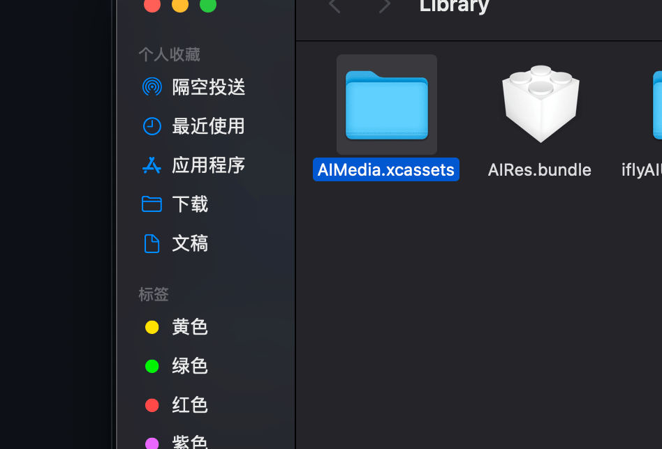
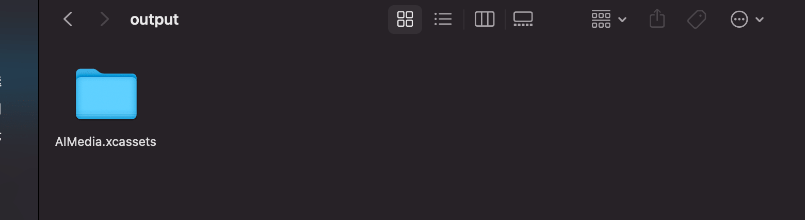

<!-- README.md -->

# node + crunch 实现批量图片无损压缩

2021-10-17

## 缘由

公司的SDK业务需要做包体size优化，首先瞄准图片资源

## 设计

一个含有图片资源的文件夹作为输入，压缩其中其中的图片资源 ，输出一个完全相同的文件夹

* crunch  做压缩
* node做文件名检测，递归资源复制
* shell 做命令行封装

##  crunch

[crunch](https://github.com/chrissimpkins/Crunch.git)

* 安装 

这里使用封装号的sh脚本

```shell
#!/bin/bash
set -e


git clone https://github.com/chrissimpkins/Crunch.git

cd crunch

make build-dependencies
make install-executable

```

安装完成后，我们参照crunch文档，做简单的压缩测试 

```
crunch 图片资源途径
```
## node 

使用node对难缠的图片名称做解析，因为其名称千奇百怪，比如包含中文，包含"_" ，包含"/"等等，所以需要特殊解析

使用的是 TS ，下面是具体的代码 ：

* index.ts

```ts
import * as fs from 'fs';
import * as process from "process";
import * as path from "path";
import * as shell from "shelljs";

function getPngFile(dir:string ,list = []) : Array<string>{
    const files = fs.readdirSync(dir);
    for (const item of files) {
        const itemPath = path.join(dir , item);
        
        
        const stat = fs.statSync(itemPath);
        // console.log(`${item}`+JSON.stringify(stat))  
        if (stat.mode === 16877) {
            // 是一个目录
            getPngFile(itemPath , list);
        }else {
            
            // 不是目录 
            if (item.endsWith('.png')) {
                list.push(itemPath);
            }
        }
    }
    
    return list;
}

function zipPng(pngList:Array<string> ) {
    var cmd = 'crunch'
    for (const item of pngList) {
        cmd += ' '+`'${item}'`
    }
    console.log(cmd);
    shell.exec(cmd);
}

function  replacePng(list:Array<string>) {
    try {
        for (const item of list) {
            const pathParse = path.parse(item);
            const name = pathParse.name+'-crunch'
            const oriFile = pathParse.dir + '/' + name + pathParse.ext;
            const newFile = item
            let cmd = `mv -f '${oriFile}' '${item}'`
            shell.exec(cmd)
        }
    } catch (error) {
        
    }
    
}

const arg : any = process.argv.splice(2);
const rootDir:string = arg[0];

const pathParse= path.parse(rootDir)
let rootName = pathParse.name;
if (pathParse.ext) {
    rootName += pathParse.ext
}
const cpRootDir =  path.join(__dirname , "output") ;
console.log(cpRootDir);

shell.exec(`rm -r ${cpRootDir}`)
shell.exec(`mkdir ${cpRootDir}`)

const buildPath = path.join(cpRootDir , rootName);
console.log(buildPath);

shell.exec(`cp -r '${rootDir}' '${buildPath}'`)
/// png  图片地址
const list = []
const pngList = getPngFile(buildPath , list);
console.log(pngList);
/// zip
zipPng(pngList);
/// replace
replacePng(pngList)

console.log(` success to : ${buildPath}`);


```

这段代码会递归的解析图片，并压缩，然后对整个输入文件夹做复制，最后输入新的文件夹到./output

## shell

sh 封装一个命令行，快捷使用压缩命令

* run.sh

```shell
#!/bin/bash
set -e

workdir=$(cd $(dirname $0); pwd)

node "$workdir/png/index.js" $1

```

## 测试

本地有一个AIMedia.xcassets资源文件，这是iOS的一般图片资源储存方式



AIMedia.xcassets 作为输入

```shell
sh run.sh  AIMedia.xcassets
```

输入日志:

```
[
  '/Users/subing/Documents/jenkins/src/zipPng/png/output/AIMedia.xcassets/Ble/ai_ble_sj_icon.imageset/编组 10@2x.png',
  '/Users/subing/Documents/jenkins/src/zipPng/png/output/AIMedia.xcassets/Ble/ai_ble_sj_icon.imageset/编组 10@3x.png',
  '/Users/subing/Documents/jenkins/src/zipPng/png/output/AIMedia.xcassets/Common/aI_toukui.imageset/img_toukui02@2x.png',
  '/Users/subing/Documents/jenkins/src/zipPng/png/output/AIMedia.xcassets/Common/aI_toukui.imageset/img_toukui02@3x.png',
  '/Users/subing/Documents/jenkins/src/zipPng/png/output/AIMedia.xcassets/Common/ai_back.imageset/ic_commom__back@2x.png',
  ...
[ 81.95% ] /Users/subing/Documents/jenkins/src/zipPng/png/output/AIMedia.xcassets/Home/ai_home_top_sel.imageset/img_yilianjie@3x-crunch.png (158369 bytes)
[ 100.00% ] /Users/subing/Documents/jenkins/src/zipPng/png/output/AIMedia.xcassets/Home/ai_lanya_icon.imageset/ico_lanya@2x-crunch.png (386 bytes)
 success to : /Users/subing/Documents/jenkins/src/zipPng/png/output/AIMedia.xcassets
```
 
下面是新生成的资源文件：


 
## 总结 

利用不同的工具，整合成一套

